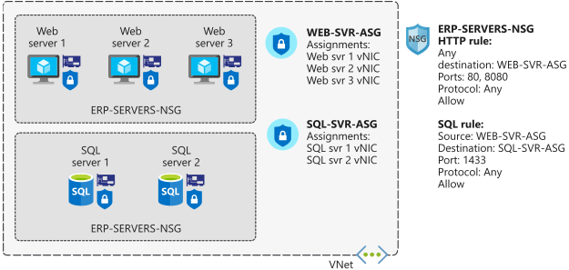

# AZ-104 - Renewal Practice

- Host a web application with Azure App Service
- Build a containerized web application with Docker
- Secure your Azure Storage account
- Secure and isolate access to Azure resources by using network security groups and service endpoints

    

    

- Protect your virtual machines by using Azure Backup
- Configure virtual machine availability
- Manage users and groups in Microsoft Entra ID
